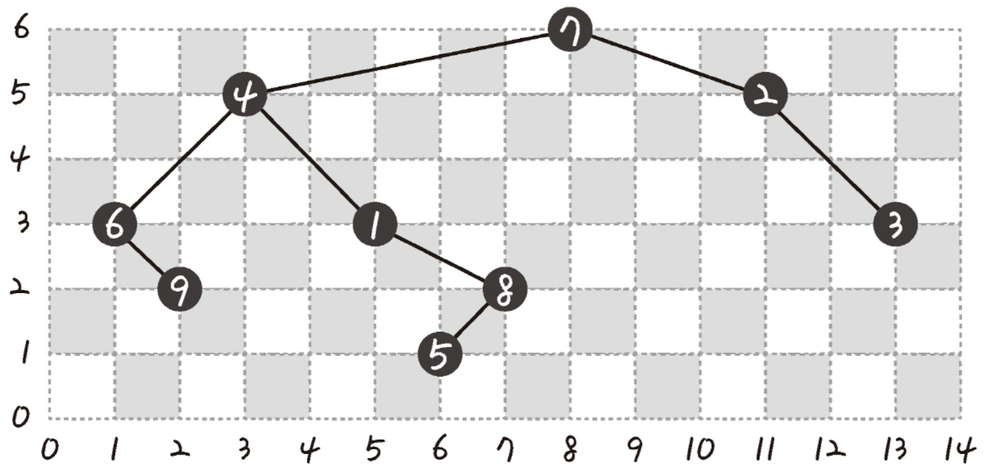

# 길 찾기 게임

## 문제 풀이

```java
import java.util.*;

class Solution {
    private class Node {
        public final int value;
        public final int x;
        public final int y;

        public Node left;
        public Node right;

        private Node(int value, int x, int y) {
            this.value = value;
            this.x = x;
            this.y = y;
        }
    }

    private Node constructTree(Node[] nodes) {
        Node root = nodes[0];

        for (int i = 1; i < nodes.length; i++) {
            insert(root, nodes[i]);
        }

        return root;
    }

    private void insert(Node root, Node node) {
        // x 좌표에 따라 root 노트가 나타내는 트리에 node 삽입
        if (node.x < root.x) {
            // 왼쪽 서브 트리에 삽입
            if (root.left == null) {

                root.left = node;
            } else {
                insert(root.left, node);
            }
        } else {
            // 오른쪽 서브 트리에 삽입
            if (root.right == null) {
                root.right = node;
            } else {
                insert(root.right, node);
            }
        }
    }

    private void pre(Node node, List<Integer> visits) {

        if (node == null) {
            return;
        }

        visits.add(node.value);
        pre(node.left, visits);
        pre(node.right, visits);
    }

    private void post(Node node, List<Integer> visits) {

        if (node == null) {
            return;
        }

        post(node.left, visits);
        post(node.right, visits);
        visits.add(node.value);
    }

    public int[][] solution(int[][] nodeinfo) {

        Node[] nodes = new Node[nodeinfo.length];

        for (int i = 0; i< nodes.length; i++) {
            nodes[i] = new Node(i + 1, nodeinfo[i][0], nodeinfo[i][1]);
        }

        Arrays.sort(nodes, (a, b) -> b.y - a.y);

        Node root = constructTree(nodes);

        List<Integer> preorder = new ArrayList<>();
        pre(root, preorder);

        List<Integer> postorder = new ArrayList<>();
        post(root, postorder);

        return new int[][] {
                preorder.stream().mapToInt(Integer::intValue).toArray(),
                postorder.stream().mapToInt(Integer::intValue).toArray()
        };
    }
    
}
```


