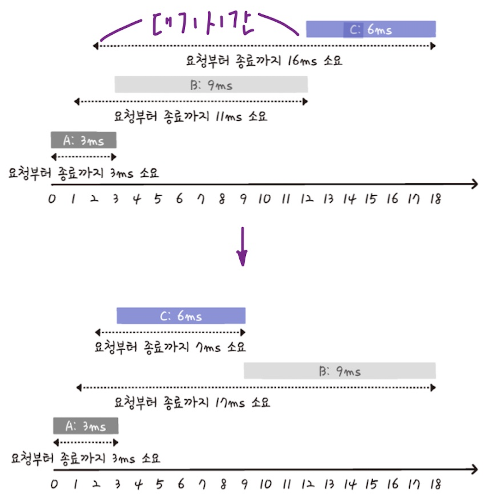
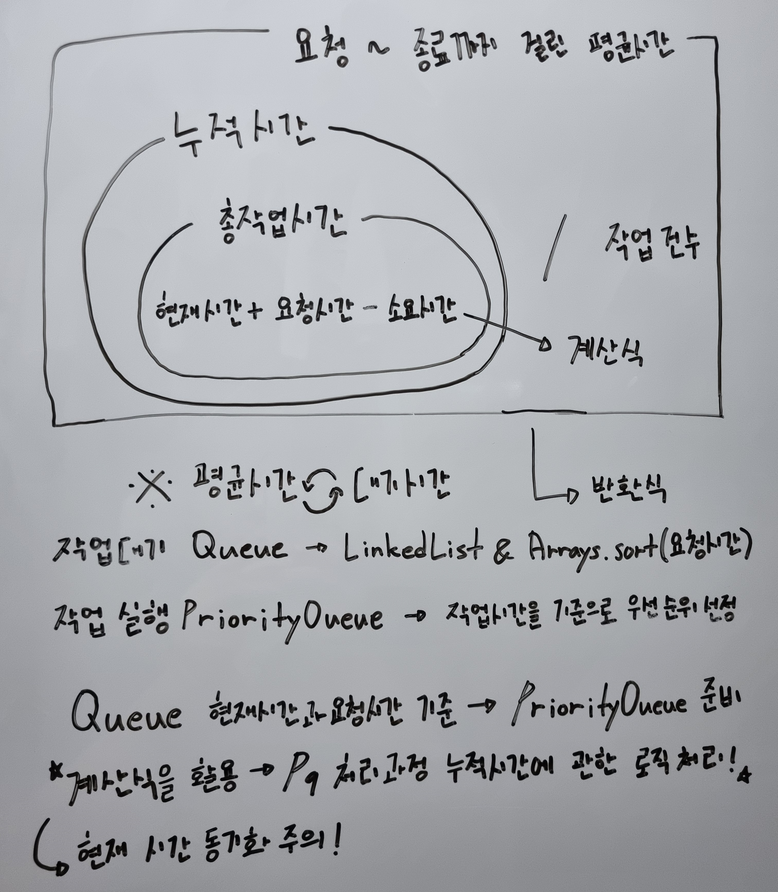

# 디스크 컨트롤러

## 문제 풀이

```java
import java.util.*;

class Solution {
    
    private class Job {
        public final int start;
        public final int duration;

        private Job(int start, int duration) {
            this.start = start;
            this.duration = duration;
        }
    }

    public int solution(int[][] jobs) {

        Job[] sortedJobs = sortJobsByStartTime(jobs);

        Queue<Job> q = new LinkedList<>(Arrays.asList(sortedJobs));
        Queue<Job> pq = new PriorityQueue<>(Comparator.comparingInt(job -> job.duration));

        int exec = 0;
        int time = 0;

        while (!q.isEmpty() || !pq.isEmpty()) {
            while (!q.isEmpty() && q.peek().start <= time) {
                pq.add(q.poll());
            }

            if (pq.isEmpty()) {
                time = q.peek().start;
                continue;
            }

            Job job = pq.poll();
            exec += time + job.duration - job.start;
            time += job.duration;
        }

        return exec / jobs.length;
    }

    private Job[] sortJobsByStartTime(int[][] jobs) {
        return Arrays.stream(jobs)
                .map(job -> new Job(job[0], job[1]))
                .sorted(Comparator.comparingInt(job -> job.start))
                .toArray(Job[]::new);
    }
    
}
```




