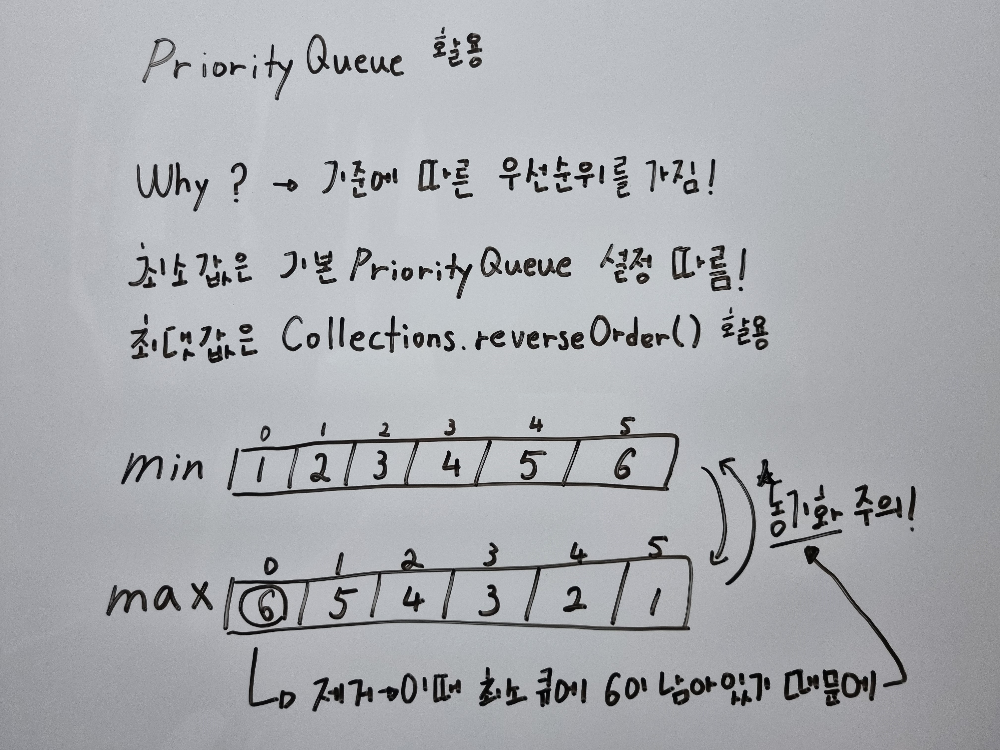

# 이중 우선순위 큐

## 문제 풀이

```java
import java.util.*;

class Solution {
    
    private class DoublyPriorityQueue {
        private int size = 0;
        private final Queue<Integer> minPq = new PriorityQueue<>();
        private final Queue<Integer> maxPq = new PriorityQueue<>(Collections.reverseOrder());

        public void add(int value) {
            minPq.add(value);
            maxPq.add(value);
            size++;
        }

        public void removeMax() {
            if (size == 0) {
                return;
            }

            int max = maxPq.poll();
            minPq.remove(max);

            if (--size == 0) {
                maxPq.clear();
                minPq.clear();
            }
        }

        public void removeMin() {
            if (size == 0) {
                return;
            }

            int min = minPq.poll();
            maxPq.remove(min);

            if (--size == 0) {
                maxPq.clear();
                minPq.clear();
            }
        }

        public int max() {
            if (size == 0) {
                return 0;
            }
            return maxPq.peek();
        }

        public int min() {
            if (size == 0) {
                return 0;
            }
            return minPq.peek();
        }
    }

    public int[] solution(String[] operations) {
        DoublyPriorityQueue dpq = new DoublyPriorityQueue();

        for (String operation : operations) {
            String[] tokens = operation.split(" ");
            String command = tokens[0];
            String value = tokens[1];
            switch (command) {
                case "I" -> dpq.add(Integer.parseInt(value));
                case "D" -> {
                    if (value.equals("1")) {
                        dpq.removeMax();
                    } else {
                        dpq.removeMin();
                    }
                }
            }
        }

        return new int[]{dpq.max(), dpq.min()};
    }
    
}
```


