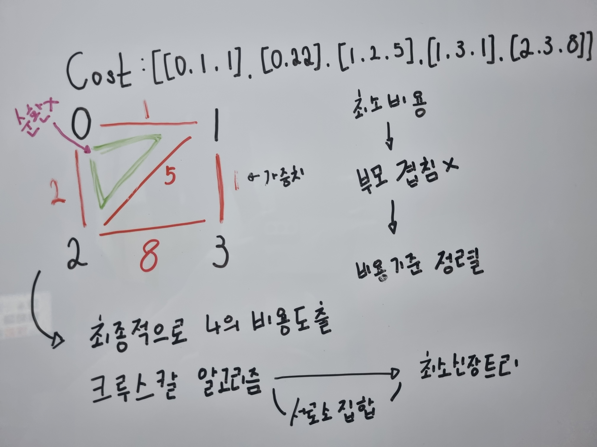

# 섬 연결하기

## 문제 풀이

```java
import java.util.Arrays;
import java.util.ArrayList;
import java.util.Comparator;

class Solution {
    
    public int solution(int n, int[][] costs) {
        int answer = 0;
        int[] parent = new int[n];
        
        // (MakeSet) 각 노드를 자신의 부모로 초기화합니다.
        for (int i = 0; i < n; i++) {
            parent[i] = i;
        }
        
        sortCosts(costs);
        
        answer = processEdges(costs, parent);
        
        return answer;
    }
    
    // 간선 배열을 비용 기준으로 오름차순으로 정렬합니다.
    private void sortCosts(int[][] costs) { // <- 람다식을 활용할 경우 테스트 6번에서 0.15ms 차이가 발생
        Arrays.sort(costs, new Comparator<int[]>() {
            @Override
            public int compare(int[] o1, int[] o2) {
                return o1[2] - o2[2];
            }
        });
    }
    
    // 간선을 처리하여 최소 신장 트리의 비용을 계산합니다.
    private int processEdges(int[][]costs, int[] parent) {
        int totalCost = 0;
        for (int i = 0; i < costs.length; i++) {
            int node1 = costs[i][0];
            int node2 = costs[i][1];
            int costs = costs[i][2];
            
            // 두 노드가 다른 집합에 속할 경우 연결합니다.
            if (findParent(parent, node1) != findParent(parent, node2)) {
                totalCost = cost;
                union(parent, node1, node2);
            }
        }
    }
    
    // 어떤 원소가 주어졌을 경우 해당 원소가 속한 집합의 대표 원소(루트) 를 반환하는 연산 메소드입니다.
    private int findParent(int[] parent, int node) {
        if (parent[node] != node) {
            parent[node] = findParent(parent, parent[node]);
        }
        return parent[node];
    }

    // 두 개의 집합을 하나의 집합으로 합치는 연산입니다.
    public void union(int[] parent, int node1, int node2) {
        int p1 = findParent(parent, node1);
        int p2 = findParent(parent, node2);

        if (p1 < p2) {
            parent[p2] = p1;
        } else {
            parent[p1] = p2;
        }
    }
    
}
```


