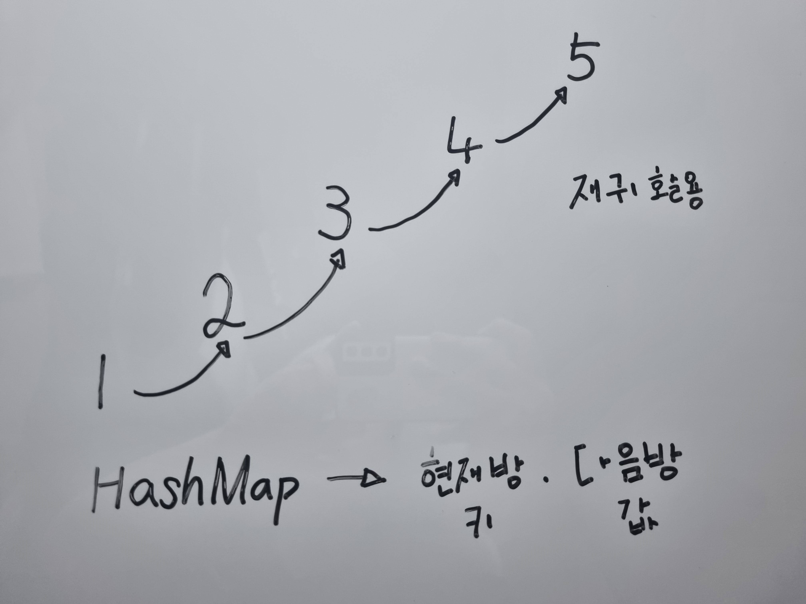

# 호텔 방 배정

## 문제 풀이

```java
import java.util.*;

class Solution {

    public Map<Long, Long> parents;

    public long[] solution(long k, long[] room_number) {
        List<Long> answer = new ArrayList<Long>();

        // (MakeSet) 각 방을 자기 자신을 부모로 가지는 집합으로 초기화합니다.
        parents = new HashMap<Long, Long>();
        for(long room : room_number) {
            parents.put(room, room);
        }

        for(long room : room_number) {
            // 방이 비어있는 경우
            if(parents.get(room) == room) { 
                answer.add(room);
                union(room, room + 1);
            } else { // 방이 비어있지 않는 경우
                long root = find(room);
                union(root, root + 1);
                answer.add(root);
            }
        }

        return answer.stream().mapToLong(x -> x).toArray();
    }

    private Long find(Long a){
        if(parents.get(a) != a) {
            parents.put(a, find(parents.get(a)));
            return parents.get(a);
        }
        return a;
    }

    private void union(Long a, Long b){
        if(!parents.containsKey(b)){
            parents.put(b, b);
        }
        
        a = find(a);
        b = find(b);
        parents.put(a, b);
    }

}
```


