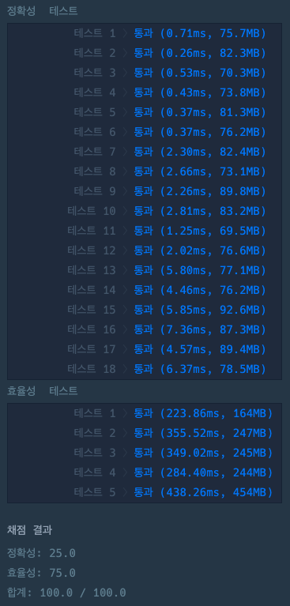

# 가사검색

## 문제 풀이

```java
class Solution {
    
    class Trie {
        Trie[] child = new Trie[26];
        int count;
        
        void insert(String str) {
            Trie curr = this;
            for (char ch : str.toCharArray()) {
                curr.count++;
                int idx = ch - 'a';
                if (curr.child[idx] == null) {
                    curr.child[idx] = new Trie();
                }
                curr = curr.child[idx];
            }
            curr.count++;
        }
        
        int search(String str) {
            Trie curr = this;
            for (char ch : str.toCharArray()) {
                if (ch == '?') {
                	return curr.count;
                }
                curr = curr.child[ch - 'a'];
                if (curr == null) {
                	return 0;
                }
            }
            
            return curr.count;
        }
    }
    
    Trie[] TrieRoot = new Trie[10000];
    Trie[] ReTrieRoot = new Trie[10000];
    
    public int[] solution(String[] words, String[] queries) {
        int[] answer = new int[queries.length];
        int ansIdx = 0;
        
        for (String str : words) {
            int idx = str.length() - 1;
            if (TrieRoot[idx] == null) {
                TrieRoot[idx] = new Trie();
                ReTrieRoot[idx] = new Trie();
            }
            
            TrieRoot[idx].insert(str);
            str = new StringBuilder(str).reverse().toString();
            ReTrieRoot[idx].insert(str);
        }
        
        for (String str : queries) {
            int idx = str.length() - 1;
            if (TrieRoot[idx] == null) {
                answer[ansIdx++] = 0;
                continue;
            }
            
            if(str.charAt(0) != '?') {
                answer[ansIdx++] = TrieRoot[idx].search(str);
            } else {
                str = new StringBuilder(str).reverse().toString();
                answer[ansIdx++] = ReTrieRoot[idx].search(str);
            }
        }
        
        return answer;
    }
    
}
```

`실행 결과`  


`설명`  


> 트라이   
> 문자열을 저장하고 효율적으로 탐색하기 위한 트리 형태의 자료구조이다.  
> 우리가 검색할 때 볼 수 있는 자동완성 기능, 사전 검색 등 문자열을 탐색하는데 특화되어있는 자료구조이다.

위 문제는 접두사와 접미사에 관련된 탐색이 주를 문자열을 효율적으로 관리할 수 있는 트라이를 선택했다.

이 문제에서 중요한 점은 트라이의 탐색 비용을 최소화하여 효율성을 극대화하는 것이었고, 이를 위해 문제에서 제시한 와일드카드를 활용해 탐색을 조기에 종료함으로써 성능을 최적화했다.

## 참고 자료
`취업과 이직을 위한 프로그래머스 코딩 테스트 문제 풀이 전략 : 자바 편`