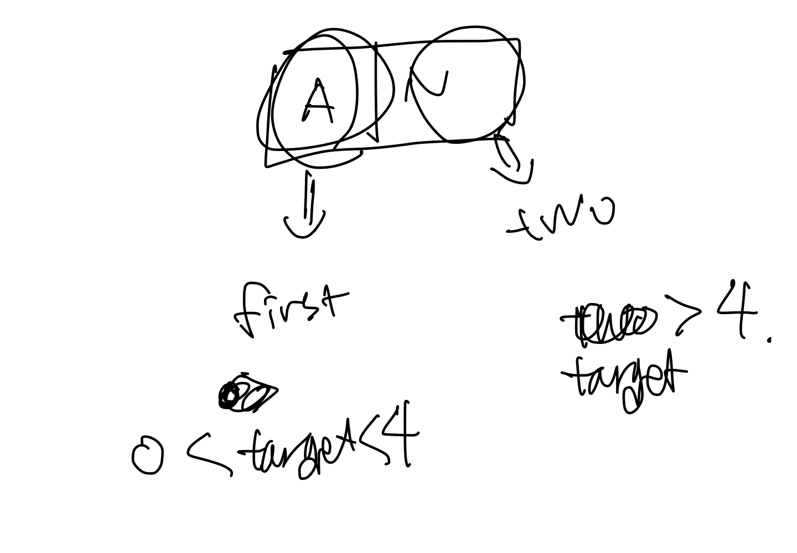

# [link](https://school.programmers.co.kr/learn/courses/30/lessons/118666)

## 성격 유형 검사하기 - 문제 풀이

```
import java.util.*;

class Solution {
    public String solution(String[] survey, int[] choices) {
        StringBuilder answer = new StringBuilder();
        
        int[] scores = {3, 2, 1, 0, 1, 2, 3}; // 나누기로 구현하는 방법도 있음. 
        
        Map<Character, Integer> map = new HashMap<>();
        
        for(int i=0;i<survey.length; i++){
            char first = survey[i].charAt(0);
            char two = survey[i].charAt(1);
            int choice = choices[i];
            if(choice > 0 && choice < 4) map.put(first, map.getOrDefault(first, 0) + scores[choice-1]);
            else if(choice > 4) map.put(two, map.getOrDefault(two, 0) + scores[choice-1]);
        }
        
        answer.append(map.getOrDefault('R',0)>= map.getOrDefault('T',0) ? "R": "T");
        answer.append(map.getOrDefault('C',0)>= map.getOrDefault('F',0) ? "C": "F");
        answer.append(map.getOrDefault('J',0)>= map.getOrDefault('M',0) ? "J": "M");
        answer.append(map.getOrDefault('A',0)>= map.getOrDefault('N',0) ? "A": "N");
        
        return answer.toString();
    }
}
```

<br/><br/>

1. scores로 각각의 성격 유형에 점수에 따른 지표를 넣어주었다.
2. first에서 survey에서 charAt(0)을 통해서 first에 담아주었다. 
3. two에서 survey charAt(1)을 통해서 두번째에 담아주었다. 
4. 1< choice < 4 map.put에 다가 넣어준다. get을 통해서 반환해주고 getOrDefault를 통해서 없다면 0을 반환하여 +scores에서 더해주도록 만들었다. 
5. answer.append를 통해서 각각을 구해주었다. 