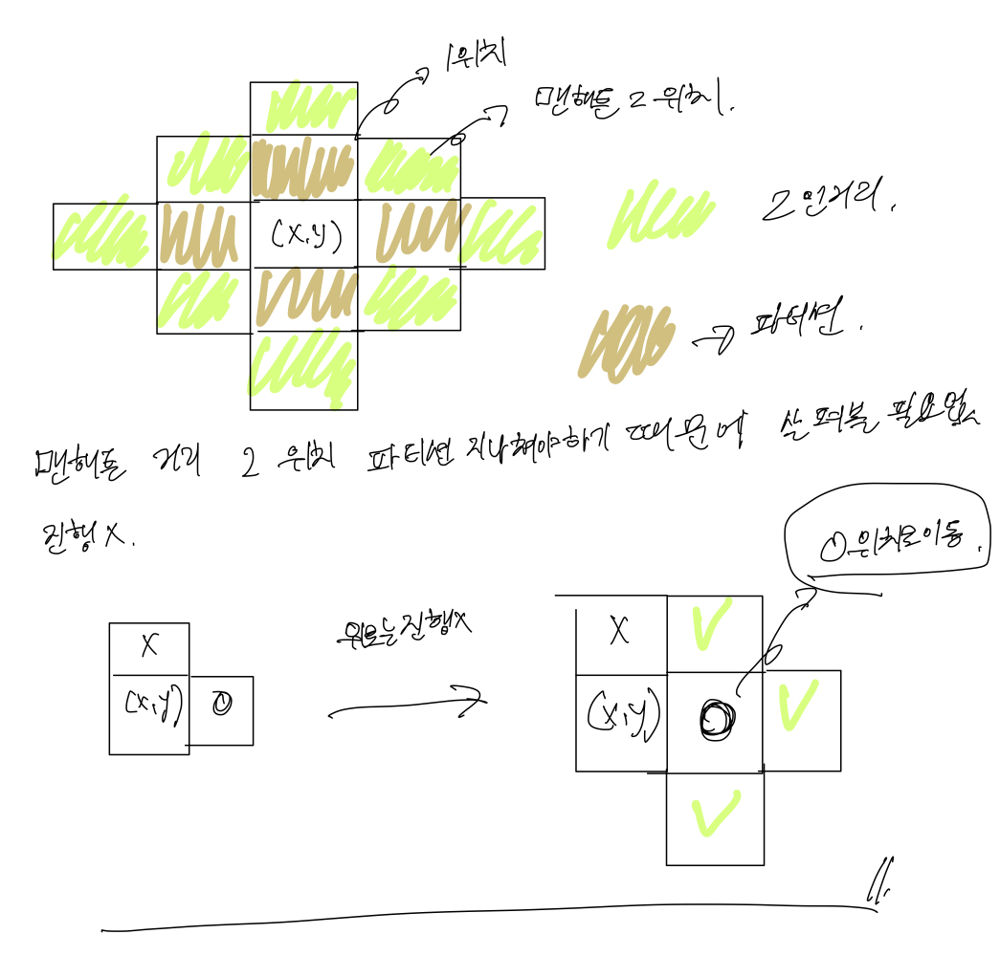

# [link] (https://school.programmers.co.kr/learn/courses/30/lessons/81302)

## 내가 푼 문제 풀이
1. flag가 false이면 더이상 돌지 않도록 선언 해주었다.
2. 반복문을 통해서 places안에 있는 String을 charAt을 통하여 하나씩 빼주었다. 이때, 따로 저장을 통해서 구하지 않고 매개변수로 bfs에 바로 넘겨주었음. 
3. bfs를 통해서 맨하튼까지의 거리를 Queue에 넣어주었으며 거리가 2 이내에 있다면 false를 반환해주었다.  
4. if(p[ny].charAt(nx)=='P' && d <= 2) return false; 2이하에 'P'가 존재하면 return false를 반환해준다. 
5. else if(p[ny].charAt(nx)=='O' && d < 2) q.offer(new int[] { nx, ny}); 다음 큐에 넣어준다.
6. 3번과 4번의 과정을 반복할 때, 3번 조건에 걸리지 않는다면 true를 반환해준다.

```
import java.util.*;

class Solution {
    public static int[] solution(String[][] places) {
        int[] answer = new int[places.length];
        
        for(int i=0; i<places.length; i++) {
            String[] p = places[i];
            
            
            boolean flag = true;
            for(int y=0; y<5 && flag; y++) {
                for(int x=0; x<5 && flag; x++) {
                    if(p[y].charAt(x)=='P') {
                        if(!bfs(x,y,p)) flag = false;
                    }
                }
            }
            
            answer[i] = flag ? 1 : 0;
        }
        
        return answer;
    }
    
    private static boolean bfs(int x, int y, String[] p) {
        int []dx = {-1, 1, 0, 0};
        int []dy = {0, 0, -1, 1};
        Queue<int[]> q = new LinkedList<>();
        q.offer(new int [] {x , y});
        
        while(!q.isEmpty()) {
            int []position = q.poll();
            
            for(int i=0; i<4; i++) {
                int nx = position[0] + dx[i];
                int ny = position[1] + dy[i];
                
                if(nx < 0 || ny < 0 || nx >= 5 || ny >= 5 ||  (nx == x && ny == y)) continue;
                
                int d = Math.abs(nx - x) + Math.abs(ny - y);
                
                if(p[ny].charAt(nx)=='P' && d <= 2) return false;
                else if(p[ny].charAt(nx)=='O' && d < 2) q.offer(new int[] { nx, ny});
            }
        }
        return true;
    }
    
}
```


## 책 풀이

1. isNextToVolunteer는 다음 응시자가 앉아 있는지에 대한 여부를 구한다.
2. isDistanced(char[][] room, int x, int y) function 규칙을 방향을 통해서 규칙을 지키지 않은지에 대한 여부에 거리를 구해준다.
3. private boolean isDistanced(char[][] room) 거리 여부를 통해서 true, false 반환 'P' 가 존재하고 그 주위를 탐색할 함수이다. 

```
import java.util.*;

class Solution {
    
    private static final int dx[] = {0, -1, 1, 0};
    private static final int dy[] = {-1, 0, 0, 1};
    
    private boolean isNextToVolunteer(char[][] room, int x, int y, int exclude) {
        for(int d = 0; d < 4; d++) {
           if(d == exclude) continue;
            
            int nx = x + dx[d];
            int ny = y + dy[d];
            
            if(ny < 0 || ny >= room.length || nx < 0 || nx >= room[ny].length) continue;
            if(room[ny][nx] == 'P') return true;
       }
       
        return false;
    }
    
    private boolean isDistanced(char[][] room, int x, int y) {
        for(int d = 0; d < 4; d++) {
            int nx = x + dx[d];
            int ny = y + dy[d];
            if(ny < 0 || ny >= room.length || nx < 0 || nx >= room[ny].length) continue;
            switch(room[ny][nx]) {
                case 'P': return false;
                case 'O': 
                    if(isNextToVolunteer(room, nx, ny, 3 - d)) return false;
                    break;
            }
        }
        return true;
    }
    
    
    private boolean isDistanced(char[][] room) {
        for(int y=0; y < room.length; y++){
            for(int x=0; x < room[y].length; x++) {
                if(room[y][x] != 'P') continue;
                if(!isDistanced(room,x,y)) return false;
            }
        }
        return true;
    }
    
    public int[] solution(String[][] places) {
        int[] answer= new int[places.length];
        
        for(int i=0; i<answer.length; i++) {
            String[] place = places[i];
            char[][] room = new char[place.length][];
            for(int j=0; j < room.length; j++){
                room[j] = place[j].toCharArray();
            }
            if(isDistanced(room)) {
                answer[i] = 1;
            } else {
                answer[i] = 0;
            }
        }
        
        return answer;
    }
}
```