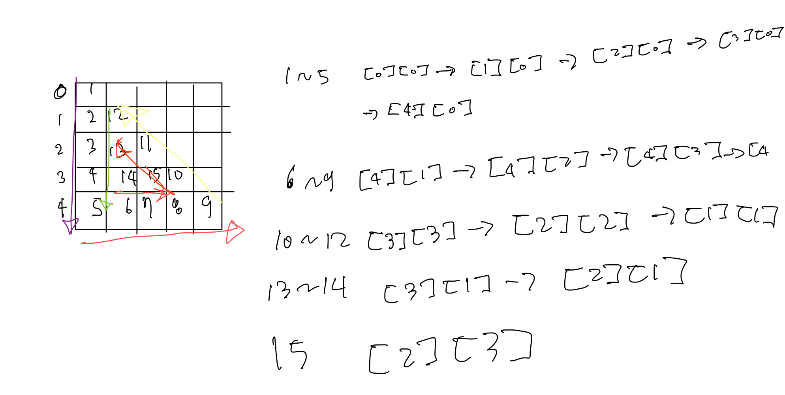

# [link](https://school.programmers.co.kr/learn/courses/30/lessons/68645)

## 내가 푼 문제 풀이

1. answer 배열을 등차 수열의 합을 통해서 선언해주었다. 
2. 각 경우의 수가 3개이고 이것이 i를 통해서 이루어지기에 i%3을 나누어 각각의 경우의 수에 따라 움직이게 만들어줌. 
3. arr[i][j]가 0이면 break 아니라면 answer에다가 값을 넣어주었다.



```
class Solution {
    public int[] solution(int n) {
        int[] answer = new int[n*(n+1)/2];
        
        int [][]arr = new int[n][n];
        
        int num = 1;
        int x = 0;
        int y = -1;
        
        
        for(int i=0; i<n; i++){
            for(int j=i; j<n; j++){
                
                switch (i%3) {
                    case 0: 
                        ++y;
                        break;
                    case 1: 
                        ++x;
                        break;
                    case 2:
                        --y;
                        --x;
                        break;
                }
                
                arr[y][x] = num++;
            }
        }
        
        int index = 0;
        for(int i=0; i<n; i++){
            for(int j=0; j<n; j++) {
                if(arr[i][j]==0) break;
                answer[index++] = arr[i][j];
            }
        }
        
        return answer;
    }
}
```


## 책 문제 풀이
1. 해당 부분은 위에서 풀어 준 것을 방향 배열을 선언하여 푼 방식이다.
2. if문이 두개 들어간 이유는 방향을 바꿔주고 바꿔준 방향에서 값이 들어갈 수 있는지 판단하는 것이다. 아니라면 while문을 break로 빠져나온다.
```
class Solution {
    
    private static final int[] dx = {0, 1, -1};
    private static final int[] dy = {1, 0, -1};

    public int[] solution(int n) {
        int[][] triangle = new int[n][n];
        int v = 1;
        int x = 0;
        int y = 0;
        int d = 0;
        
        while(true) {
            triangle[y][x] = v++;
            int nx = x + dx[d];
            int ny = y + dy[d];
            if(nx == n || ny == n || nx == -1 || ny == -1 || triangle[ny][nx] != 0) {
                d = (d + 1) % 3;
                nx = x + dx[d];
                ny = y + dy[d];
                if(nx == n || ny == n || nx == -1 || ny == -1 || triangle[ny][nx] != 0) break;
            }
            y = ny;
            x = nx;
        }
        
        int []result = new int[v - 1];
        int index = 0;
        for(int i=0; i<n;i++) {
            for(int j=0; j<=i; j++) {
                result[index++] = triangle[i][j];
            }
        }
        
        return result;
    }
}
```

