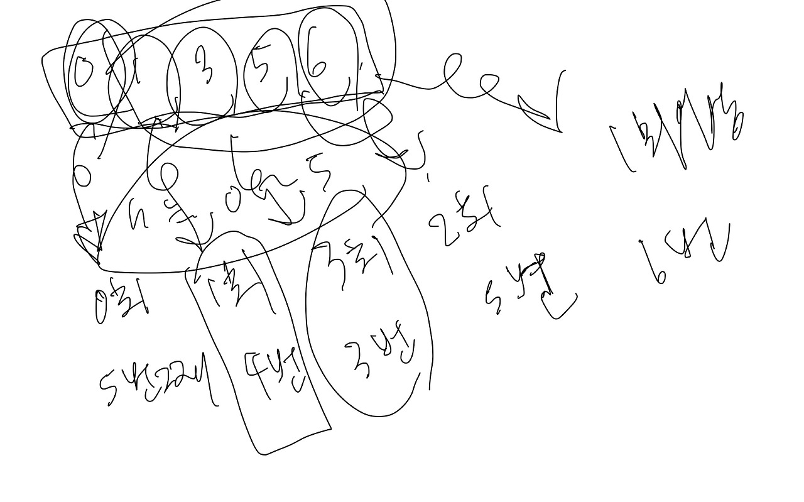

## H-Index




```
import java.util.Arrays;

class Solution {
    public int solution(int[] citations) {
        int answer = 0;
        
        Arrays.sort(citations);
        
        for(int h = citations.length; h>=1; h--) {
            if(isValid(citations, h)) return h;
        }
        
        return 0;
    }
    
    private boolean isValid(int[] citations, int h) {
        int index = citations.length - h;
        return citations[index] >= h;
    }
}
```

자바 문제 풀이이고 뒤에서 부터 구하여 h를 빼주면 해당 논문의 인용 회수를 구할 수 있습니다.

이를 통해서 isValid를 통해서 인용한 논문의 개수가 인용 회수보다 크거나 같을 때, return 하면 된다.

이를 통해 문제를 풀었음. 사실 문제가 글이 이해가 안되서 ... 좀 보고 풀었다. ㅠ


```
def solution(citations):
    answer = 0
    citations.sort();
    for idx, citation in enumerate(citations):
        if citation >= len(citations) - idx:
            return len(citations) -idx
    return 0
```