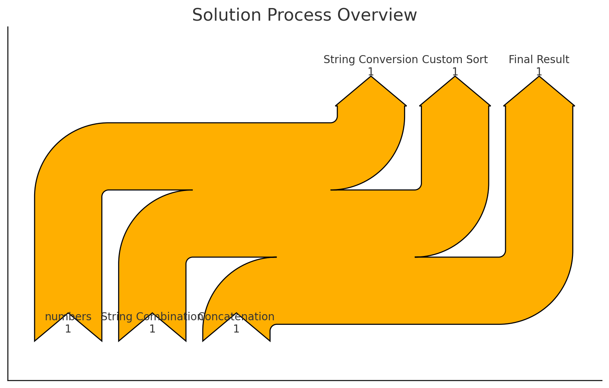

## 가장 큰 수
### [link](https://school.programmers.co.kr/learn/courses/30/lessons/42746)


## 내가 푼 문제 풀이

```
import java.util.*;

class Solution {
    
    
    public String solution(int[] numbers) {
        
        String []strValues = new String[numbers.length];
        
        for(int i=0; i< numbers.length; i++) {
            strValues[i] = String.valueOf(numbers[i]);
        }
        
        
        Arrays.sort(strValues, new Comparator<String>(){
           @Override
           public int compare(String o1, String o2) {
               return (o2+o1).compareTo(o1+o2);
           }
            
        });
        
        if(strValues[0].equals("0"))
            return "0";
        
        
        StringBuilder builder = new StringBuilder();
        
        for(String str : strValues) {
            builder.append(str);
        }
        
        return builder.toString();
    }
    

}
```


프로세스 흐름 



<br/>


1. 숫자를 문자열로 변환
- 숫자 배열 int[] numbers 을 문자열 배열 (String[] strValues)로 변환
- 예를 들어, [6, 10, 2] 이라는 숫자 배열은 ["6" , "10", "2"] 라는 문자열 배열로 변환
2. 커스텀 정렬 
- `Arrays.sort(strValues, new Comparator<String>(){...});`
- 정렬 기준은 `o1` 과 `o2`라는 두 문자열에 대해 `o2+o1`와 비교 `o1+o2`를 비교합니다. `"62"` 와 `"26"`을 비교해서 더 크므로 6이 앞으로 오도록 정렬된다. 
3. 가장 큰 수가 0인 경우 처리
- `if(strValues[0].equals("0")) return "0";` 
- 정렬된 배열의 첫 번쨰 요소가 `"0"`이면, 모든 숫자가 0이라는 의미이므로 결과로 `"0"` 반환
4.결과 문자열 생성 
- 정렬된 문자열 배열을 하나의 문자열로 합침.


## 책 문제 풀이
```
import java.util.*;
import java.util.stream.Collectors;

class Solution {
    
    
    public String solution(int[] numbers) {
        return Arrays.stream(numbers)
            .mapToObj(String::valueOf)
            .sorted((s1,s2) -> {
                int original = Integer.parseInt(s1 + s2);
                int reversed = Integer.parseInt(s2 + s1);
                
                return reversed - original;
            })
            .collect(Collectors.joining(""))
            .replaceAll("^0+", "0");
    }
    

}
```