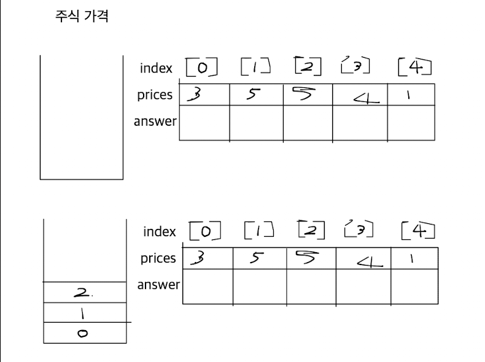
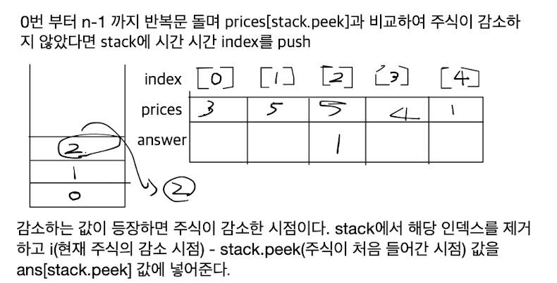
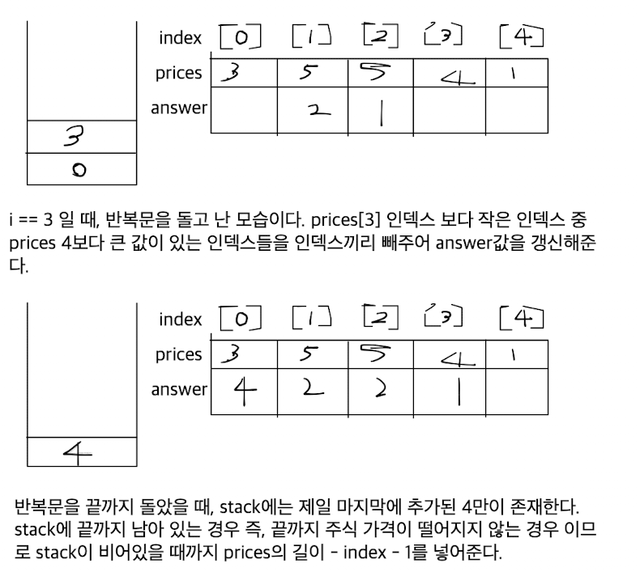

## 주식가격 - Level2
## [link] (https://school.programmers.co.kr/learn/courses/30/lessons/42584)

## 문제 풀이
1. index가 기준이다. 즉, index가 시간이라 생각하고 stack에 담아서 구한다.
2. 가격을 비교하는 로직을 준비한다. 단 , 이때 while문을 사용하여 현재 인덱스 기점의 prices값보다 크다면 계속해서 비교하여 인덱스로 경과시간을 구해준다.
3. 위에와 같이 비교한 인덱스는 answer를 구했기에 stack에서 pop해준다.
4. 마지막으로 들어간 값과 인덱스가 계속 증가한 값을 비워주기 위하여 stack이 비어있을 때까지 구해준다. 이때, length 에서 인덱스에서 -1 을 해주는데 0번 인덱스부터 시작하기 때문이다.


````

import java.util.*;
import java.util.stream.IntStream;

class Solution {
    public int[] solution(int[] prices) {
        int[] answer = new int[prices.length];
        Stack<Integer> stack = new Stack<>();
        
        IntStream.range(0, prices.length)
                .forEach(num -> {
                    computePriceDecreaseIntervals(stack, prices, answer, num);
                });
        
        fillRemainingPriceIntervals(stack, prices, answer);
        
        return answer;
    }
    
    private static void computePriceDecreaseIntervals(Stack<Integer> stack, int []prices, int[] answer, int num) {
        while(!stack.isEmpty() && prices[num] < prices[stack.peek()]) {
            answer[stack.peek()] = num - stack.peek();
            stack.pop();
        }
        stack.push(num);
    }
    
    private static void fillRemainingPriceIntervals(Stack<Integer> stack, int []prices, int[] answer) {
        while(!stack.isEmpty()) {
            answer[stack.peek()] = prices.length - stack.peek() - 1;
            stack.pop();
        }
    }
}
````



